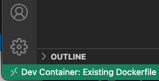

# Python with docker

This is a sample repository for using python with docker.

prerequisite:
- docker desktop
- vscode with extensions: Python, Docker, Remote - Container

building the image:
> docker build -t irmb/python_sample .

running the container:
> docker run irmb/python_sample

debugging in the container:
1. Start remote container session: CMD+Shift+P -> Remote-Containers: Open Folder in Workspace
2. validate session successfully started
3. install python extension in the new vs-code window
4. add breakpoint and start debugging (create python launch.json file, if not yet done)

